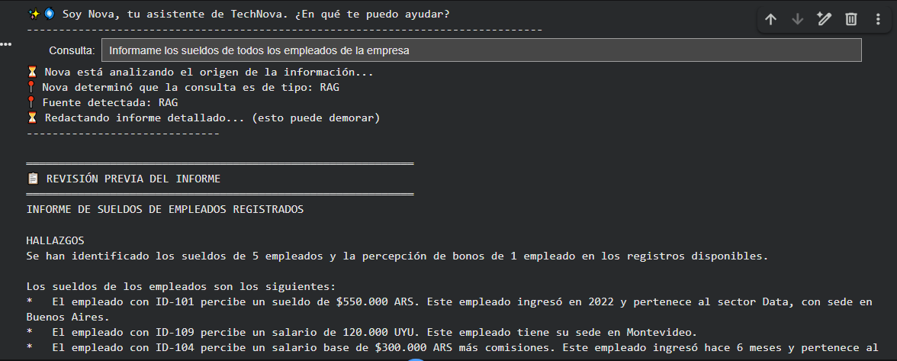
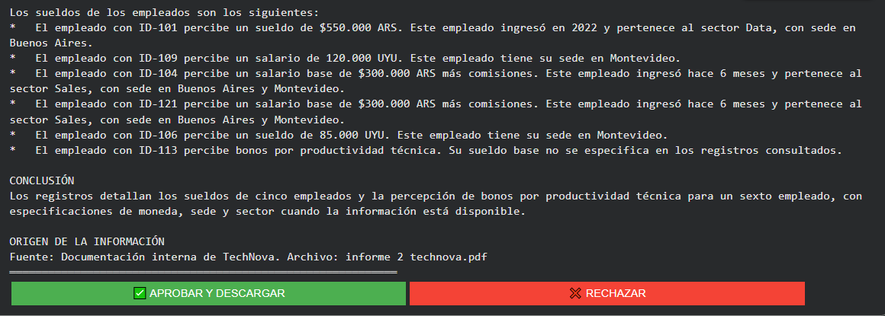
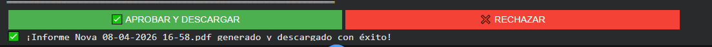
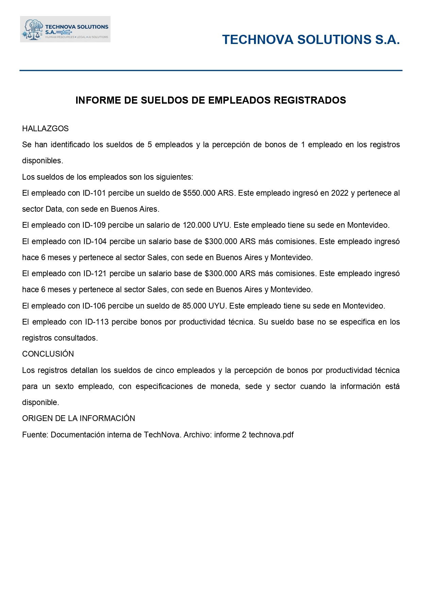
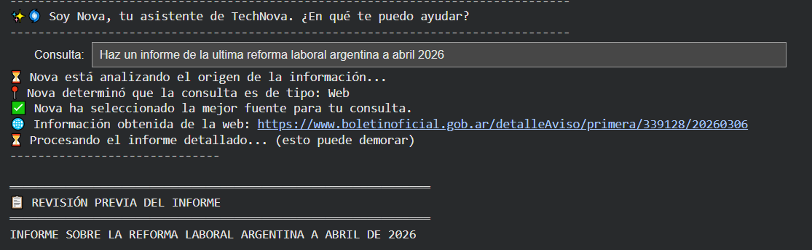
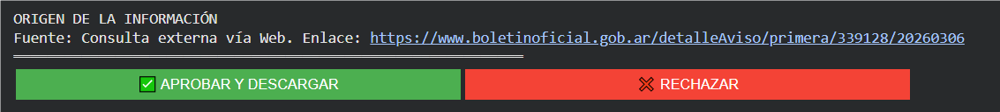
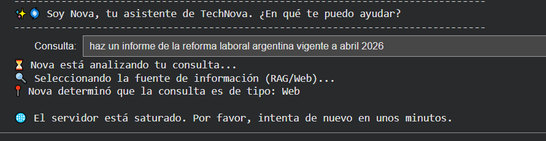
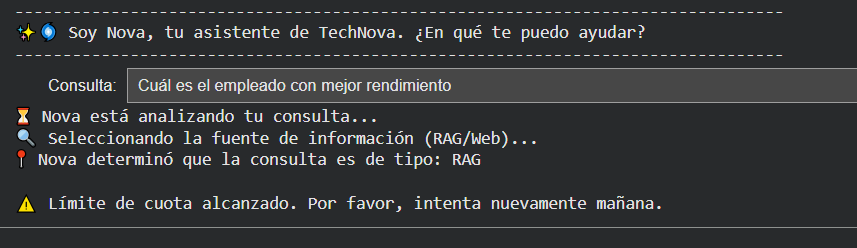

# Nova 🤖 | Sistema Agéntico de RR.HH. & LegalTech

**Nova** es un asistente inteligente orientado a la gestión de Recursos Humanos con enfoque legal.  
Este proyecto es una evolución del agente desarrollado en la *Inmersión IA DEV* de Alura Latam.

> ⚠️ **ENTORNO DE PRUEBA**  
> TechNova Solutions S.A. es una **empresa ficticia**.  
> Todos los datos y documentos se utilizan con fines educativos.

---

## 🎯 Finalidad del proyecto

Este proyecto tiene como objetivo responder consultas vinculadas a la gestión de Recursos Humanos, combinando información interna y externa bajo criterios técnicos y legales.

Los datos del personal se encuentran anonimizados mediante IDs para proteger la privacidad.  
El agente puede:

- Generar informes sobre rendimiento y métricas internas  
- Analizar licencias y vacaciones  
- Interpretar normativa laboral y jurisprudencia  
- Determinar automáticamente la fuente de información (RAG o Web) según la consulta  

El foco no está solo en responder, sino en hacerlo con trazabilidad, control y coherencia en el análisis.

---

## 🧪 Ejemplos de uso

Algunos casos donde este agente puede aplicarse:

- Consultar qué empleados no tomaron la totalidad de sus vacaciones  
- Analizar el rendimiento de un área en base a métricas internas  
- Obtener información actualizada sobre normativa laboral aplicable  
- Verificar cambios en legislación y su impacto en la empresa  

El sistema decide automáticamente si la consulta requiere información interna (RAG) o externa (Web), y genera un informe técnico con trazabilidad de fuentes.

---

## ▶️ Ejecutar en Google Colab

El notebook será incorporado en una próxima actualización.  
Actualmente el proyecto se encuentra en etapa de mejora y validación.

---

## 🚀 Cómo usar

### 1. Abrir en Colab
Hacé clic en el botón **Open in Colab** y guardá una copia.

### 2. Configurar API Keys

Configurar en Colab (🔑):
- GEMINI_API_KEY  
- SERPAPI_API_KEY  

### 3. Cargar datos
Subir los PDFs que desees analizar.
En el diseño del PDF podés adaptarlo al nombre de tu empresa y agregar tu logo donde lo indica el código.

### 4. Ejecutar
El sistema:

- Clasifica (RAG / Web)  
- Recupera información  
- Permite validación humana antes de generar el PDF  

---

## 🛠️ Tecnologías

- Python (Google Colab)  
- Gemini 2.5 Flash  
- LangGraph  
- LangChain  
- FAISS  
- SerpAPI  
- PyPDF  
- ReportLab  

---

## 🧩 Arquitectura del sistema (TechNova Solutions S.A.)

Pregunta → Agente → (RAG | Web) → Contexto → Modelo → Previsualización → Aprobación → PDF

```
┌────────┐   ┌────────┐   ┌──────────────┐
│ START  │ → │ AGENTE │ → │  RAG | WEB   │
└────────┘   └────────┘   └──────┬───────┘
                                 │
                 ┌───────────────┴───────────────┐
                 ↓                               ↓
        ┌──────────────────┐            ┌──────────────────┐
        │ DOCUMENTOS (RAG) │            │  WEB (SERPAPI)   │
        └────────┬─────────┘            └────────┬─────────┘
                 └──────────────┬───────────────┘
                                ↓
                      ┌──────────────────┐
                      │  GENERACIÓN      │
                      │  (MARKDOWN)      │
                      └────────┬─────────┘
                               ↓
                ────── Flujo posterior al grafo ──────
                               ↓
                      ┌──────────────────┐
                      │ PREVISUALIZACIÓN │
                      └────────┬─────────┘
                               ↓
                      ┌──────────────────┐
                      │ APROBACIÓN (HITL)│
                      └────────┬─────────┘
                               ↓
                      ┌──────────────────┐
                      │      PDF         │
                      └────────┬─────────┘
                               ↓
                          ┌────────┐
                          │  END   │
                          └────────┘
```

El agente está construido utilizando LangGraph, donde cada nodo representa una etapa del flujo de decisión:

- **Agente:** analiza la pregunta y decide la fuente (RAG o Web)  
- **RAG:** consulta documentos internos (PDFs)  
- **Web:** obtiene información externa (SerpAPI)  
- **Generación:** construye el informe técnico  
- **Validación (Human in the loop):** muestra una previsualización para aprobar o rechazar  
- **Salida:** genera el PDF final  

El flujo comienza en `START`, pasa por el agente que decide el camino (RAG o Web), y finaliza con la generación del informe validado.

---

### ⚙️ Funcionamiento general

El sistema sigue estos pasos:

1. Carga y procesamiento de documentos (PDF)  
2. División del texto en fragmentos (chunks)  
3. Generación de embeddings (vectores semánticos)  
4. Almacenamiento en FAISS (vector store)  
5. Búsqueda semántica (RAG)  
6. Integración de búsqueda web (SerpAPI)  
7. Definición del flujo con LangGraph  
8. Generación del informe técnico  
9. Previsualización en consola  
10. Aprobación humana (human in the loop)  
11. Generación del PDF final  

---

## 🔍 Características

- RAG con documentos internos  
- Consulta web con fuente  
- Generación de PDF  
- Human in the loop  
- Control del comportamiento del agente mediante ingeniería de prompts
  
---

## ⚖️ Enfoque legal

- Datos anonimizados (IDs)  
- Trazabilidad de fuentes  
- Prioridad normativa actual  
- Manejo de errores (429 / 503)  

---

## 🔧 Cambios que hicieron la diferencia

- **Privacidad desde el diseño**  
Todo el análisis se realiza con datos anonimizados (IDs).  
No se exponen datos sensibles a la LLM. Desde mi perfil como abogada, esto no es un agregado, sino parte del diseño.

- **Modularidad y limpieza de código**  
Separé el proyecto en tres bloques: agente (cerebro), generación del PDF (estética) e interfaz.  
Esto permitió ordenar el código y empezar a escalar sin romper la lógica.

- **Gestión de errores y robustez (try/except)**  
Durante las pruebas aparecieron distintos casos que fueron cubiertos desde el código:  
- Error 429 (límite de cuota): el sistema detecta la situación y avisa que se puede retomar al día siguiente.  
- Error 503 (servidor saturado): identifica caídas temporales y sugiere reintentar en unos minutos, evitando que la interfaz quede “colgada”.

- **Criterio de eficiencia en RAG**  
Se implementó LangChain para procesar la información interna, utilizando chunks y FAISS de forma directa.  
A diferencia del enfoque original (múltiples vectores + merge), se optó por una arquitectura más simple, facilitando la ejecución del proyecto (plug & play).  
Como contrapartida, para escalar a grandes volúmenes de documentos sería necesario volver a una lógica más segmentada para manejar mejor los límites de tokens.

- **Mejor experiencia de uso (UX)**  
Se diseñó un flujo en pasos donde el agente informa qué está haciendo.  
Se incorporó además un human in the loop: el informe se previsualiza antes de descargarse, permitiendo aprobarlo o rechazarlo.

- **Uso de RAG y trazabilidad**  
Cuando el agente utiliza información interna, indica la fuente y cita el nombre del archivo.  
Si la fuente es externa, devuelve el link correspondiente.  
También se ajustaron los prompts para evitar generalizaciones y resúmenes incompletos.

- **Bug con encoding (aprendizaje)**  
Se resolvieron fallos en la generación del PDF causados por emojis en los textos generados por la IA, normalizando el encoding a latin-1.  
Un detalle pequeño, pero clave para la estabilidad del archivo.

- **Salida más prolija y timestamp**  
El PDF incorpora logo, mejor estructura y un timestamp con hora de Argentina, lo que permite identificar con precisión cada versión generada durante las pruebas.

---

## 📸 Capturas del funcionamiento del agente

### Flujo con RAG (información interna)



### Human in the loop (validación previa)


### Informe generado


### Consulta web (fuente externa)


### Human in the loop (consulta web)


### Manejo de errores



---

## 🧠 Reflexión final

Construir Nova fue un ejercicio de equilibrio: aplicar el rigor del Derecho a la lógica de la programación, sin perder de vista la cercanía de la consultoría.

Más que sumar funcionalidades, el foco estuvo en entender el por qué de cada decisión: cómo responde el agente, de dónde toma la información y bajo qué criterios.

La tecnología no es perfecta, pero la capacidad de analizar, ajustar y mejorar el proceso, sí es lo que marca la diferencia.

---

## 👩‍💻 Autor

**Noelia Orsini**  
Abogada · Programadora · Counselor  

🔗 https://www.linkedin.com/in/noelia-orsini
